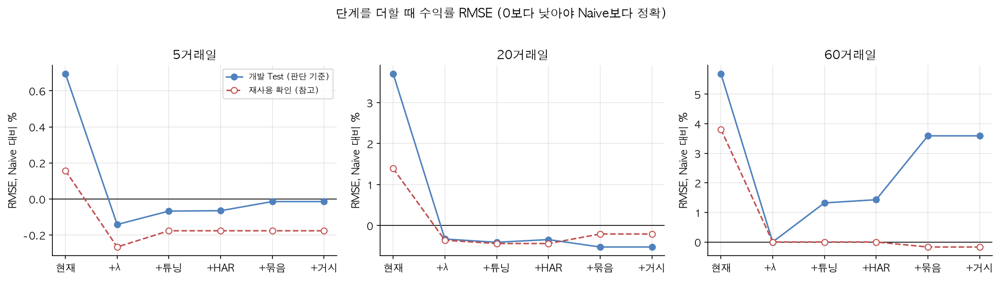
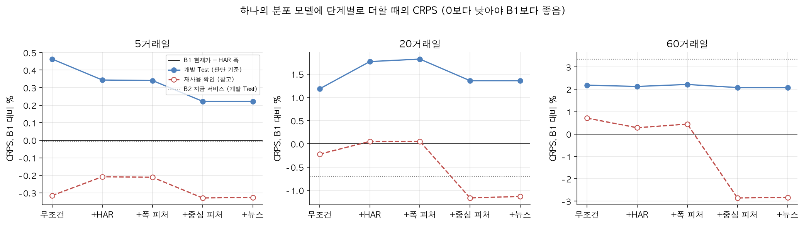
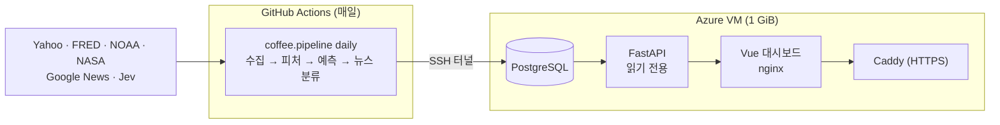

# 커피 선물 가격 전망

아라비카 커피 선물(KC=F)의 5·20·60거래일 뒤 가격이 들어갈 범위와 대략적인 방향을 하나의 분포로 예측해, 카페가 원두를 미리 살지 판단하도록 돕는 데이터 분석·E2E 파이프라인 프로젝트입니다. 수집 → 피처 → 모델 비교 → DB 적재 → API → 대시보드까지 직접 만들었습니다.


## 문제 정의

카페는 원두를 몇 주에서 몇 달 앞서 계약합니다. 가격이 오를 것 같으면 지금 사고, 내릴 것 같으면 미루고 싶습니다. 그래서 거래일 t의 종가 기준으로 h거래일 뒤의 로그수익률을 예측 대상으로 정했습니다.

$$y_h = \ln(P_{t+h} / P_t), \quad h \in \{5, 20, 60\}$$

학부 캡스톤에서는 Attention-LSTM으로 가격 수준을 예측했습니다. 이번에는 같은 문제를 처음부터 다시 설계하면서 "단순한 기준선보다 나은가"를 모든 판단의 기준으로 삼았습니다. 구매 결정에 필요한 것은 정확한 미래 가격 하나가 아니라 가격이 들어갈 범위와 대략적인 방향이라서, 최종 서비스는 y_h의 분포를 예측하고 범위·상승 확률·구매 신호를 모두 그 분포에서 냅니다(노트북 07).

## 데이터

| 자료 | 내용 | 언제부터 쓸 수 있다고 보는가 |
|---|---|---|
| Yahoo Finance | KC=F 일봉, 콜롬비아 페소(COP=X) | 종가는 당일, 환율은 다음 날 |
| FRED·ALFRED | 브라질 헤알, 미국 금리, WTI, 해상 운임 PPI | 최초 공개일 다음 날 (ALFRED 이전 기간은 공개 지연 가정) |
| NOAA | ENSO 지수(ONI) | 3개월 계절이 끝난 다음 달 11일 |
| NASA POWER | 브라질·콜롬비아 산지 6곳의 강수·기온 | 관측일 + 4일 |
| Google News + TypeSafe Jev | 커피 기사별 상승·하락 압력 확률 | 분석이 끝난 뒤 첫 거래일 마감 |

모든 값은 "그날 실제로 알 수 있었는가"를 기준으로 붙였습니다(as-of 결합). 피처는 가격 8개, 거시 5개, 기후 29개(강수·기온 편차, 90일 강수 지수, 고온·한파, ENSO), 계절·해거리 주기 4개입니다. 기상 편차는 고정 평년값 대신 직전 10년의 같은 달과 비교합니다. 수익률 모델을 다시 설계하면서(노트북 03b) 후보 피처 20개를 더했습니다. 단기 위험 2개, 거시의 긴 변화 6개, 그리고 기후 요약 12개입니다. 기후 요약은 직전 10년의 같은 날짜 ±15일과 비교한 표준화 편차(z)를 나라별로 묶고, 가뭄·한파 같은 이상기후가 기준을 넘은 날 수와 서리철·개화기에만 켜지는 값을 담습니다. 분포 모델(07)은 여기에 뉴스 점수 1개(기사가 없는 날 0인 희소 피처)를 더해 67개를 모두 씁니다.

원자료의 오류 시세는 정한 규칙으로만 고칩니다. 환율·WTI·운임·ENSO·기온은 하루 변화가 그 전까지 변화로 만든 IQR 울타리 20배 밖이면 직전 값을 씁니다(`coffee.features.clean_sources`). 1.5배 울타리는 페소 일간 변화의 7.9%, 강수 변화의 31%, 2021년 서리 주간의 커피 가격까지 이상치로 잡아 실제 움직임을 지웁니다. 20배에서는 페소의 잘못된 시세 17개(2013-07-12 종가 1,910 대신 3.67 등)와 WTI 2020-04-20만 바뀝니다. 커피 가격(예측 대상)·금리(계단형)·강수(원래 튀는 자료)는 그대로 두고, 강수는 음수만 바꿉니다.

## 분석 방법

- 2006년부터 학습하고 2012–2021년을 한 해씩 예측하는 walk-forward 10회로 모델과 설정을 골랐습니다. 2022–2025년은 고른 설정을 한 번만 적용한 보류 구간, 2026년은 최종 모델의 사후 확인 구간입니다(둘 다 이전 연구에서 본 적이 있어 미사용 평가셋이라고 부르지 않습니다). 학습 행은 목표일이 학습 구간을 넘지 않게 자르고 평가 행은 구간 끝까지 모두 채점합니다.
- 수익률은 현재가 유지(Naive), 방향은 학습 구간의 상승 비율, 변동성은 직전 변동성을 기준선으로 삼았습니다.
- h일 수익률은 날짜가 겹쳐 오차가 이어지므로 블록 bootstrap(블록 길이 h)으로 구간을 냈습니다.
- 수익률 모델은 03b에서 중첩 검증으로 다시 골랐습니다. 평가 연도마다 그 전 해들(2009년부터)을 각각 그 전까지의 자료로 예측한 성적으로 모델·설정·피처 묶음과 예측을 줄이는 비율 λ를 고릅니다. 후보와 판단 규칙은 계산 전에 노트북 첫 셀에 적어 고정했습니다(사전 등록).
- 최종 서비스는 07의 분포 모델입니다. 지평마다 y = μ(x) + σ(x)·Z 하나를 맞춥니다. 중심 μ는 방향(절편 없이 피처의 선형 결합), 폭 σ는 변동폭(HAR 입력 + 피처), 모양 Z는 학습에 쓰지 않은 해의 표준화 잔차입니다. 점 하나의 RMSE 대신 분포 전체를 채점하는 CRPS로 학습하고, 피처를 얼마나 쓸지(L2 벌점)는 03b와 같은 중첩 검증으로 해마다 고릅니다. 기준선은 현재가 유지 + HAR 변동성 폭(B1)과 이전 서비스(B2)입니다.

노트북 순서: [01 데이터·EDA](notebooks/01_data_and_eda.ipynb) → [02 피처 선택](notebooks/02_feature_selection.ipynb) → [03 수익률·방향](notebooks/03_return_direction.ipynb) → [03b 수익률 재설계](notebooks/03b_return_redesign.ipynb) → [04 변동성](notebooks/04_volatility.ipynb) → [05 뉴스 진단](notebooks/05_news_signal.ipynb) → [05b 뉴스 보정](notebooks/05b_news_correction.ipynb) → [07 분포 모델](notebooks/07_distribution_model.ipynb) → [06 최종 모델](notebooks/06_final_model.ipynb)(07에서 고른 설정을 동결하므로 07 다음에 실행)

## 결과

### 1. 수익률의 크기는 예측하지 못했습니다

개발 구간에서 모든 모델이 Naive보다 RMSE가 컸습니다. 서비스에 고른 모델은 보류 구간에서도 Naive보다 RMSE가 0.7% / 1.7% / 3.8% 컸고, 60일 방향 정확도는 38%였습니다.

| 지평 | 가장 나은 모델 | Naive 대비 RMSE | 단순 LSTM |
|---|---|---|---|
| 5일 | LightGBM | +0.9% | – |
| 20일 | LightGBM | +3.8% | +17.1% |
| 60일 | Ridge | +4.9% | – |

그래서 03b에서 고르는 방법(중첩 검증, 튜닝), 예측 크기(λ 축소, HAR 척도), 입력(지평별 묶음, 기후 요약, 거시 장기)을 미리 정한 규칙으로 한 번에 다시 시험했습니다. 같은 평가 행에서 03의 모델과 비교한 개발 구간 결과입니다.

| 지평 | 03의 모델 | 03b | Naive 대비 95% 구간 | 재사용 확인 2022–2025 |
|---|---|---|---|---|
| 5일 | +0.7% | 0.0% | [−0.5, +0.5] | −0.2% |
| 20일 | +3.7% | −0.5% | [−2.6, +1.7] | −0.2% |
| 60일 | +5.7% | +3.6% | [+0.9, +6.5] | −0.2% |

세 지평 모두 03의 모델보다 오차가 작아 서비스에 채택했지만, Naive보다 낫다고 말할 수 있는 지평은 없습니다. 개선의 대부분은 예측을 현재가 쪽으로 줄인 λ에서 나왔습니다(λ만 붙여도 5일 −0.1%, 20일 −0.3%, 60일 0.0%). 이상기후 피처를 정교하게 만든 효과는 구간 폭보다 작았고, 거시의 긴 변화는 어느 해에도 선택되지 않았습니다. 60일은 후보를 넓힐수록 나빠졌습니다.



### 2. 방향에는 약한 신호가 있지만 돈이 되지는 않았습니다

LightGBM 분류기의 확률을 기본 비율 쪽으로 줄이자 보류 구간 AUC가 0.54 / 0.60 / 0.60(5 / 20 / 60일)이었고 Brier 점수가 기본 비율보다 조금 나았습니다. 하지만 신호대로 사도 정기 구매보다 싸게 사지는 못했고(보류 구간 +0.10%), 60일 신호의 적중률은 같은 날 늘 '구매'라고 한 것과 거의 같았습니다(53% 대 52%). 2026년에는 20일 AUC가 0.39로 무너졌습니다.

### 3. 5·20일 변동성은 예측됩니다

지난 5·20·60일 변동성으로 미래 변동성을 맞히는 HAR 모델이 직전 변동성보다 RMSE를 5일은 개발 구간 25%, 보류 구간 27%, 2026년 21% 줄였고, 20일은 14%, 20%, 18% 줄였습니다. 이 프로젝트에서 기준선을 분명히 넘은 예측은 이 둘뿐입니다. 60일은 보류 구간에서 오히려 2% 나빠 기준선보다 낫다고 말할 수 없습니다. 80% 예상 범위의 실제 적중률은 보류 구간 72–78%로 목표보다 낮았습니다.


### 4. 뉴스 점수는 이미 일어난 일을 설명했습니다

점수와 가장 강하게 관련된 것은 기사가 나온 날의 수익률(상관 0.21)이었고 이후 수익률과는 관련이 없었습니다. 미리 정한 실험에서도 5일 예측 오차를 줄이지 못해 모델에 넣지 않았습니다. 03b의 예측 위에 뉴스 보정을 다시 더해 봐도(05b) 5일은 오차가 줄지 않았고 20일은 2023–2026년 네 해 모두 나빠져, 같은 규칙으로 넣지 않았습니다.


### 5. 하나의 분포 모델로 합쳤지만 기준선을 넘지는 못했습니다

예측 가격(수익률 모델), 범위(변동성 모델), 상승 확률(분류기)이 서로 다른 모델이라 서로 어긋날 수 있었습니다. 07에서 지평마다 분포 하나를 맞추고 범위·가운데 가격·상승 확률·신호를 모두 그 분포에서 내게 했습니다.

처음 등록한 v1은 실패했습니다. 개발 구간 CRPS가 B1(현재가 + HAR 폭)보다 5일 +0.6%, 20일 +1.9% 나빴고(95% 구간 모두 0보다 위), 60일은 2013-08-12 하루의 폭이 σ = 61,083으로 터졌습니다. 원인은 페소 환율의 잘못된 시세, 과거 평균 추세를 미래에 그대로 적용한 절편, 학습 행 잔차로 만든 좁은 모양이었습니다. 셋을 고쳐 다시 등록한 v2의 결과입니다. v1을 본 뒤 고쳤으므로 개발 구간도 두 번째로 본 것입니다.

| 지평 | B1 대비 CRPS (개발) | 95% 구간 | 80% 범위 적중률 (B1) | 상승 확률 AUC (이전 분류기) | 매수 기준 |
|---|---|---|---|---|---|
| 5일 | +0.2% | [−0.2, +0.6] | 82.7% (79.8%) | 0.53 (0.53) | 없음 |
| 20일 | +1.4% | [+0.1, +2.6] | 82.4% (79.9%) | 0.56 (0.58) | 52% |
| 60일 | +2.1% | [−0.4, +4.4] | 82.1% (81.6%) | 0.64 (0.55) | 없음 |

범위의 정확도는 기준선과 구별되지 않거나(5·60일) 조금 나빴습니다(20일). 중심 피처의 벌점은 10⁴–10⁵(강한 축소)로 골라져 방향은 조금만 반영되고, 피처 묶음을 하나씩 빼도 개발 구간 CRPS는 ±0.3% 안쪽으로만 움직였습니다. 매수 신호는 신호 적중률이 같은 날 늘 구매하는 것보다 높은 기준이 있는 20일에만 내고, 5·60일은 늘 보류합니다. 재사용 확인(2022–2025)에서는 B1 대비 −0.3 / −1.1 / −2.8%로 조금 나았지만 이미 본 구간이라 판단에 쓰지 않습니다.



### 서비스에 반영한 것

지평마다 07의 분포 모델 하나가 80% 범위, 범위의 가운데 가격, 상승 확률, 구매 신호, 최근 3년 대비 위험 수준을 모두 냅니다. 맞히려는 것이 범위라서 첫 화면 카드에 범위를 가장 크게 둡니다. 뉴스 점수는 모델의 희소 입력 하나입니다. 검증에서 기준선보다 낫다고 할 수 없지만, 출력이 서로 어긋나지 않는 하나의 모델로 바꾸기로 결정했고 그 성적(기준선 대비 CRPS)을 화면에 그대로 적습니다. 적중 기록에는 과거 예측의 범위 적중, 가운데 가격의 오차, 신호 적중을 쌓습니다. 모델은 2026-10-06 버전으로 동결했고, 이후 매일 쌓이는 실시간 예측이 첫 진짜 평가가 됩니다.

## 서비스 구조



학습·추론 코드는 노트북과 파이프라인이 같은 `coffee` 패키지를 씁니다. 자세한 데이터 계약과 배포는 [architecture.md](docs/architecture.md), 시행착오와 결정은 [development_log.md](docs/development_log.md)에 있습니다.

## 실행

Mac에서는 외부 가상환경(`$HOME/.virtualenvs/coffee-price-prediction`, Python 3.12)을 씁니다. `.env.example`을 `.env`로 복사해 키를 넣습니다.

```bash
pip install -r requirements.txt
python -m coffee.sources        # 원자료 수집 → data/sources/ (FRED_API_KEY 필요)
python -m pytest                # COFFEE_TEST_DATABASE_URL이 있으면 DB 테스트도 실행
```

노트북을 처음부터 다시 실행합니다(커널 이름은 각자 환경에 맞게 바꿉니다). 06은 07에서 고른 설정을 동결하므로 07 다음에 실행합니다.

```bash
for nb in 01_data_and_eda 02_feature_selection 03_return_direction 03b_return_redesign 04_volatility 05_news_signal 05b_news_correction 07_distribution_model 06_final_model; do jupyter nbconvert --to notebook --execute --inplace --ExecutePreprocessor.kernel_name=coffee-price-prediction "notebooks/$nb.ipynb"; done
```

로컬에서 서비스 전체를 띄웁니다(`.env`에 `POSTGRES_PASSWORD` 필요).

```bash
docker compose up -d --build
docker compose run --rm pipeline migrate
docker compose run --rm pipeline backfill
# 이미 모은 원자료에서 기상만 다시 적재할 때(collect_start=2005-01-01부터)
docker compose run --rm pipeline weather
```

대시보드는 http://localhost:8080 입니다. 프론트엔드만 개발할 때는 `uvicorn coffee.api:app`을 띄우고 `frontend/`에서 `npm install && npm run dev`를 실행합니다. 로컬 DB가 없으면 `frontend/`에서 `API_TARGET=https://coffee-price-sjinie.koreacentral.cloudapp.azure.com npm run dev`로 운영 API를 읽기 전용으로 붙여 화면을 확인합니다.

## 배운 점과 한계

- 학부 때는 기준선 없이 Attention-LSTM의 RMSE만 봤습니다. 이번에 단순 LSTM 기준 모델을 같은 조건으로 비교하니 현재가 유지보다 17% 나빴습니다(학부 모델의 Attention·정적 피처 분기는 재현하지 않았습니다). 모델을 고르기 전에 기준선부터 정해야 했습니다.
- 평가 코드에도 버그가 있었습니다. 연도별 평가가 해마다 연말 기준일을 빼고 있었다는 것을 외부 리뷰에서 찾았고, 고치자 60일 결론이 바뀌었습니다.
- "언제 알 수 있었나"를 놓치면 결과가 쉽게 부풀려집니다. 기상 공개 지연과 경제지표 수정치가 그런 함정이었습니다. 2026년에 소급 분류한 뉴스도 같은 위험을 의심했지만, 점수가 이후 수익률과 관련이 없어 분석 모델이 결과를 알고 판단했을 위험은 낮게 봅니다.
- 예측이 잘 되는 것(변동성)과 안 되는 것(수익률)을 나누고, 화면에도 각각의 검증 성적을 함께 보여 줍니다.
- 신호가 약할 때는 무엇을 예측하느냐보다 얼마나 크게 예측하느냐가 오차를 좌우했습니다. 예측을 줄이는 것만으로 Naive와의 차이 대부분이 사라졌고, 후보를 늘리면 고르는 과정 자체가 잡음을 배웠습니다(60일).
- 점 하나를 맞히는 문제로 두면 모델은 현재가 유지로 수렴합니다. 구매 결정에 맞게 분포를 예측하고 CRPS로 채점하니 범위·확률·신호가 한 모델에서 일관되게 나왔습니다. 다만 손실을 바꾼다고 없던 신호가 생기지는 않았습니다.
- 사전 등록한 실험도 실패할 수 있습니다. 분포 모델 v1의 실패는 환율 원자료의 잘못된 시세 하나에서 시작됐고, 선형 모델의 지수식 폭이 그 값을 증폭했습니다. 이상치 규칙과 입력 자르기를 넣어 다시 등록했고, 실패한 결과도 노트북 07과 개발 기록에 그대로 남겼습니다.
- 한계: Yahoo의 KC=F는 근월물 연결 가격이라 만기 교체 때의 가격 점프가 타깃에 섞여 있습니다. 2022–2026년은 개발 중 이미 본 기간이고, 분포 모델 v2는 v1을 본 뒤 고쳐 개발 구간도 두 번째로 본 것입니다. 뉴스는 실시간 분석이 아직 거의 없습니다. 이 프로젝트는 투자 조언이 아닙니다.

## 폴더 구조

```
coffee/            수집·피처·모델·평가·뉴스·DB·파이프라인·API (노트북과 서비스가 같이 씀)
notebooks/         01–07(03b·05b 포함) 분석 노트북과 결과(JSON)
frontend/          Vue 3 대시보드
model_artifacts/   동결한 최종 모델과 metadata
deploy/            VM 구성(compose, Caddy, 설정·일일 실행 스크립트)
.github/workflows/ CI(ci.yml), 일일 실행(daily.yml)
configs/           기간·지평·소스·산지 좌표
tests/             pytest
docs/              구조, 개발 기록, 그림
data_code/old_code/, docs/old_docs/   이전 버전 노트북과 문서(기록용)
```
