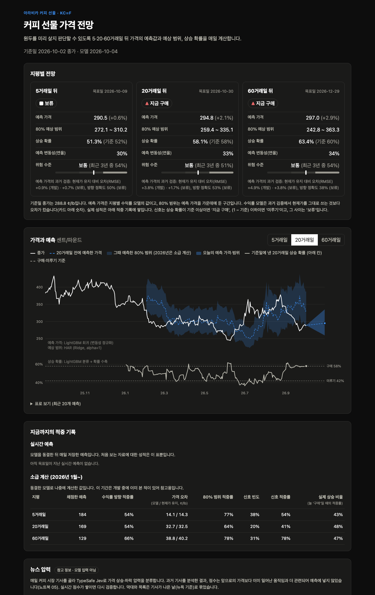
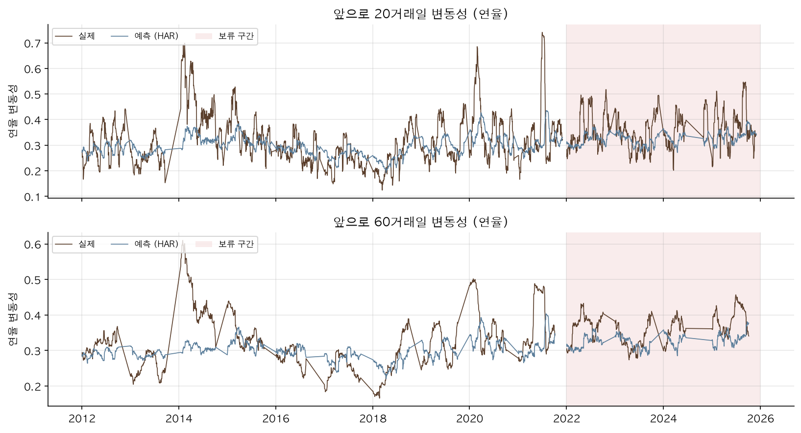
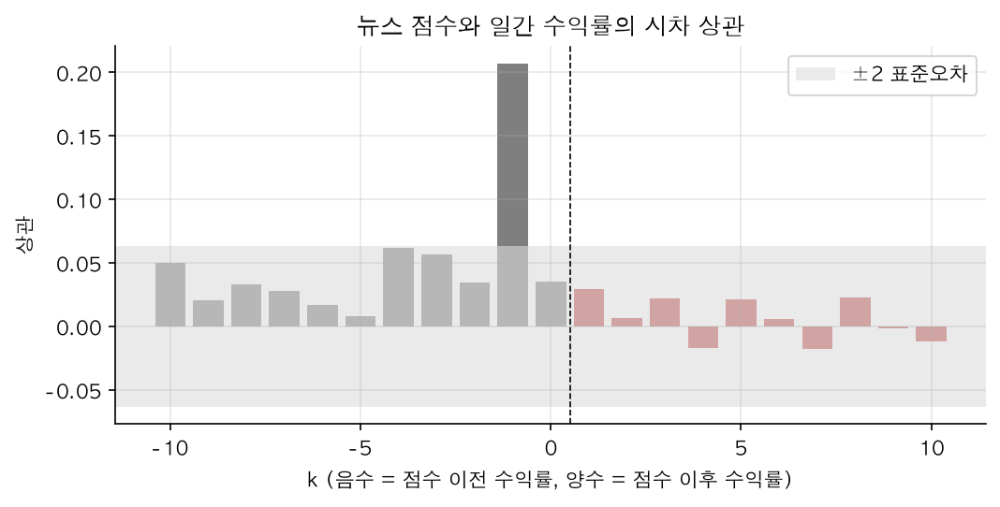
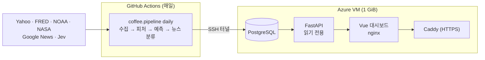

# 커피 선물 가격 전망

아라비카 커피 선물(KC=F)의 5·20·60거래일 뒤 가격을 예측해 카페가 원두를 미리 살지 판단하도록 돕는 데이터 분석·E2E 파이프라인 프로젝트입니다. 수집 → 피처 → 모델 비교 → DB 적재 → API → 대시보드까지 직접 만들었습니다.



## 문제 정의

카페는 원두를 몇 주에서 몇 달 앞서 계약합니다. 가격이 오를 것 같으면 지금 사고, 내릴 것 같으면 미루고 싶습니다. 그래서 거래일 t의 종가 기준으로 h거래일 뒤의 로그수익률을 예측 대상으로 정했습니다.

$$y_h = \ln(P_{t+h} / P_t), \quad h \in \{5, 20, 60\}$$

학부 캡스톤에서는 Attention-LSTM으로 가격 수준을 예측했습니다. 이번에는 같은 문제를 처음부터 다시 설계하면서 "단순한 기준선보다 나은가"를 모든 판단의 기준으로 삼았습니다.

## 데이터

| 자료 | 내용 | 언제부터 쓸 수 있다고 보는가 |
|---|---|---|
| Yahoo Finance | KC=F 일봉, 콜롬비아 페소(COP=X) | 종가는 당일, 환율은 다음 날 |
| FRED·ALFRED | 브라질 헤알, 미국 금리, WTI, 해상 운임 PPI | 최초 공개일 다음 날 (ALFRED 이전 기간은 공개 지연 가정) |
| NOAA | ENSO 지수(ONI) | 3개월 계절이 끝난 다음 달 11일 |
| NASA POWER | 브라질·콜롬비아 산지 6곳의 강수·기온 | 관측일 + 4일 |
| Google News + TypeSafe Jev | 커피 기사별 상승·하락 압력 확률 | 분석이 끝난 뒤 첫 거래일 마감 |

모든 값은 "그날 실제로 알 수 있었는가"를 기준으로 붙였습니다(as-of 결합). 피처는 가격 8개, 거시 5개, 기후 29개(강수·기온 편차, 90일 강수 지수, 고온·한파, ENSO), 계절·해거리 주기 4개입니다. 기상 편차는 고정 평년값 대신 직전 10년의 같은 달과 비교합니다.

## 분석 방법

- 2006년부터 학습하고 2012–2021년을 한 해씩 예측하는 walk-forward 10회로 모델과 설정을 골랐습니다. 2022–2025년은 고른 설정을 한 번만 적용한 보류 구간, 2026년은 최종 모델의 사후 확인 구간입니다(둘 다 이전 연구에서 본 적이 있어 미사용 평가셋이라고 부르지 않습니다). 학습 행은 목표일이 학습 구간을 넘지 않게 자르고 평가 행은 구간 끝까지 모두 채점합니다.
- 수익률은 현재가 유지(Naive), 방향은 학습 구간의 상승 비율, 변동성은 직전 변동성을 기준선으로 삼았습니다.
- h일 수익률은 날짜가 겹쳐 오차가 이어지므로 블록 bootstrap(블록 길이 h)으로 구간을 냈습니다.

노트북 순서: [01 데이터·EDA](notebooks/01_data_and_eda.ipynb) → [02 피처 선택](notebooks/02_feature_selection.ipynb) → [03 수익률·방향](notebooks/03_return_direction.ipynb) → [04 변동성](notebooks/04_volatility.ipynb) → [05 뉴스 진단](notebooks/05_news_signal.ipynb) → [06 최종 모델](notebooks/06_final_model.ipynb)

## 결과

### 1. 수익률의 크기는 예측하지 못했습니다

개발 구간에서 모든 모델이 Naive보다 RMSE가 컸습니다. 서비스에 고른 모델은 보류 구간에서도 Naive보다 RMSE가 0.7% / 1.7% / 3.8% 컸고, 60일 방향 정확도는 38%였습니다.

| 지평 | 가장 나은 모델 | Naive 대비 RMSE | 단순 LSTM |
|---|---|---|---|
| 5일 | LightGBM | +0.9% | – |
| 20일 | LightGBM | +3.8% | +17.1% |
| 60일 | Ridge | +4.9% | – |

### 2. 방향에는 약한 신호가 있지만 돈이 되지는 않았습니다

LightGBM 분류기의 확률을 기본 비율 쪽으로 줄이자 보류 구간 AUC가 0.54 / 0.60 / 0.60(5 / 20 / 60일)이었고 Brier 점수가 기본 비율보다 조금 나았습니다. 하지만 신호대로 사도 정기 구매보다 싸게 사지는 못했고(보류 구간 +0.10%), 60일 신호는 늘 '구매'라고 말한 것보다 적중률이 낮았습니다. 2026년에는 20일 AUC가 0.39로 무너졌습니다.

### 3. 5·20일 변동성은 예측됩니다

지난 5·20·60일 변동성으로 미래 변동성을 맞히는 HAR 모델이 직전 변동성보다 RMSE를 5일은 개발 구간 25%, 보류 구간 27%, 2026년 21% 줄였고, 20일은 14%, 20%, 18% 줄였습니다. 이 프로젝트에서 기준선을 분명히 넘은 예측은 이 둘뿐입니다. 60일은 보류 구간에서 오히려 2% 나빠 기준선보다 낫다고 말할 수 없습니다. 80% 예상 범위의 실제 적중률은 보류 구간 70–78%로 목표보다 낮았습니다.



### 4. 뉴스 점수는 이미 일어난 일을 설명했습니다

점수와 가장 강하게 관련된 것은 기사가 나온 날의 수익률(상관 0.21)이었고 이후 수익률과는 관련이 없었습니다. 미리 정한 실험에서도 5일 예측 오차를 줄이지 못해 모델에 넣지 않았습니다.



### 서비스에 반영한 것

지평마다 예측 가격(수익률 모델), 예측 가격을 가운데에 둔 80% 범위(변동성 모델), 최근 3년 대비 위험 수준, 상승 확률과 확신할 때만 내는 구매 신호를 보여 주고, 뉴스는 참고 정보로 둡니다. 수익률 모델은 검증에서 현재가를 그대로 쓰는 것보다 오차가 컸습니다. 그래도 가격이 어느 쪽으로 움직일지 보여 주고 실시간 성적을 쌓아 모델을 고쳐 나가려고 함께 표시합니다. 대신 카드마다 현재가 유지 대비 검증 성적을 적고, 적중 기록에 과거 예측이 맞았는지(방향, 가격 오차, 범위)를 쌓습니다. 모델은 2026-10-04에 동결했고(태그 `model-2026-10-04`), 이후 매일 쌓이는 실시간 예측이 첫 진짜 평가가 됩니다.

## 서비스 구조



학습·추론 코드는 노트북과 파이프라인이 같은 `coffee` 패키지를 씁니다. 자세한 데이터 계약과 배포는 [architecture.md](docs/architecture.md), 시행착오와 결정은 [development_log.md](docs/development_log.md)에 있습니다.

## 실행

Mac에서는 외부 가상환경(`$HOME/.virtualenvs/coffee-price-prediction`, Python 3.12)을 씁니다. `.env.example`을 `.env`로 복사해 키를 넣습니다.

```bash
pip install -r requirements.txt
python -m coffee.sources        # 원자료 수집 → data/sources/ (FRED_API_KEY 필요)
python -m pytest                # COFFEE_TEST_DATABASE_URL이 있으면 DB 테스트도 실행
```

노트북을 처음부터 다시 실행합니다(커널 이름은 각자 환경에 맞게 바꿉니다).

```bash
for nb in notebooks/0*.ipynb; do jupyter nbconvert --to notebook --execute --inplace --ExecutePreprocessor.kernel_name=coffee-price-prediction "$nb"; done
```

로컬에서 서비스 전체를 띄웁니다(`.env`에 `POSTGRES_PASSWORD` 필요).

```bash
docker compose up -d --build
docker compose run --rm pipeline migrate
docker compose run --rm pipeline backfill
```

대시보드는 http://localhost:8080 입니다. 프론트엔드만 개발할 때는 `uvicorn coffee.api:app`을 띄우고 `frontend/`에서 `npm install && npm run dev`를 실행합니다.

## 배운 점과 한계

- 학부 때는 기준선 없이 Attention-LSTM의 RMSE만 봤습니다. 이번에 단순 LSTM 기준 모델을 같은 조건으로 비교하니 현재가 유지보다 17% 나빴습니다(학부 모델의 Attention·정적 피처 분기는 재현하지 않았습니다). 모델을 고르기 전에 기준선부터 정해야 했습니다.
- 평가 코드에도 버그가 있었습니다. 연도별 평가가 해마다 연말 기준일을 빼고 있었다는 것을 외부 리뷰에서 찾았고, 고치자 60일 결론이 바뀌었습니다.
- "언제 알 수 있었나"를 놓치면 결과가 쉽게 부풀려집니다. 기상 공개 지연, 경제지표 수정치, 뉴스 소급 분류가 모두 그런 함정이었습니다.
- 예측이 잘 되는 것(변동성)과 안 되는 것(수익률)을 나누고, 화면에도 각각의 검증 성적을 함께 보여 줍니다.
- 한계: Yahoo의 KC=F는 근월물 연결 가격이라 만기 교체 때의 가격 점프가 타깃에 섞여 있습니다. 2022–2026년은 개발 중 이미 본 기간이고 뉴스는 실시간 분석이 아직 거의 없습니다. 이 프로젝트는 투자 조언이 아닙니다.

## 폴더 구조

```
coffee/            수집·피처·모델·평가·뉴스·DB·파이프라인·API (노트북과 서비스가 같이 씀)
notebooks/         01–06 분석 노트북과 결과(JSON)
frontend/          Vue 3 대시보드
model_artifacts/   동결한 최종 모델과 metadata
deploy/            VM 구성(compose, Caddy, 설정·일일 실행 스크립트)
.github/workflows/ CI(ci.yml), 일일 실행(daily.yml)
configs/           기간·지평·소스·산지 좌표
tests/             pytest
docs/              구조, 개발 기록, 그림
data_code/old_code/, docs/old_docs/   이전 버전 노트북과 문서(기록용)
```
